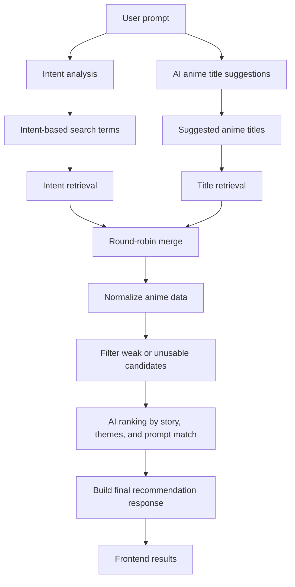

# Building Tadashii

Tadashii is an anime discovery app for people who know what they feel like watching, but do not always know the exact title to search for. Instead of forcing every request into a genre or popularity list, it lets a mood, character arc, story idea, or random feeling become the search.

This dump is a growing record of why I built Tadashii, how the pieces fit together, and what I learned while turning the idea into a working product.

## The Idea

I think I should probably start with the reason why I built this in the first place.

It all stems from those moments when I finish an anime, a series, or whatever I am watching, and I just sit there like, "Damn, I enjoyed this so much. If only I could watch something similar that captured that same specific feeling, moment, or emotion."

So I figured I could build something around that.

The idea is simple: you describe whatever you feel like watching, or whatever comes to mind, and [Tadashii](https://github.com/jaimzh/tadashii) gives you recommendations that actually try to match that feeling instead of just throwing random popular anime at you.

I also put a lot of thought into the name. Tadashii is Japanese, and from what I understand, it roughly translates to "correct" or "right." So essentially, you use Tadashii to find the **correct** show for you. The right show. The **Tadashii** show, hehe. I do not know Japanese, but that meaning felt too perfect for the idea.

## The Pipeline

The pipeline was honestly the most interesting part of the project, aside from the frontend. For the frontend, I wanted it to feel clean and elegant, with this handwritten kanji kind of energy, but yeah, the [backend pipeline](https://github.com/jaimzh/tadashii/blob/main/backend/app/api/recommend.py) is where the real thinking happened.

It starts with the user prompt.

From there, Tadashii runs two systems at the same time. One side analyzes the intent of the prompt, and the other side asks AI for anime title suggestions based on what the user wrote. So instead of relying on only one way of searching, it tries to understand the vibe and also pull in titles that might be related.

After that, the intent search and title search also run at the same time. The title search looks up the AI-suggested titles, while the intent search uses things like keywords, genres, themes, mood, semantic tags, and character arcs from the prompt analysis.

Then the results get merged using a round-robin approach, so one search branch does not completely dominate the list. After that, the results are normalized into the shape the app expects, filtered to remove things that are not useful, deduped by MAL ID, ranked by AI based on the actual story and theme match, and finally turned into the response the frontend displays.

That was the part that made the app feel less like a normal search bar and more like a small recommendation system. It is still not perfect, but it is way closer to the thing I had in my head.

## The Tech Stack

I decided to build the backend with [FastAPI](https://fastapi.tiangolo.com/) because of the AI features and because I figured that if this grows at some point, I might actually turn the recommendation pipeline into something more advanced, maybe even something closer to a RAG pipeline and the whole fancy vector embeddings and whatnot.

The plan was to make sure I had a good API that could be reused later. I would love to turn Tadashii into not just a web app, but maybe also a mobile app I could put on the Play Store just for the fun of it someday.

For the web stack, I decided to use something new that I was not really comfortable with, and that was [Vue](https://vuejs.org/). The whole point was that I was supposed to use this project to learn Vue. At first I wanted to use [Next.js](https://nextjs.org/), but a friend recommended Vue, and I was like, aight bet, let's use it and see if I can actually build something cool.

I did not even follow tutorials to build this, so I guess that means I am improving as a developer. I do not need to rely on tutorials as much to build things or learn from scratch anymore. It was mostly documentation, experimenting, and asking AI questions when I got stuck.

And honestly, I love how Vue makes styling and separating logic feel easy.

For styling, I could have used [Tailwind CSS](https://tailwindcss.com/), but I decided to use plain old CSS. Why? Mainly because I like vanilla CSS. It is a lot more descriptive, and it is my go-to when I want a custom design. I also did not want to add another framework layer on top of Vue. I wanted the frontend to stay simple: Vue, CSS, and the things I actually needed.

I did use [GSAP](https://gsap.com/) though, because I wanted some tween animation between elements using the [FLIP plugin](https://gsap.com/docs/v3/Plugins/Flip/).

One very important thing was the styling of the kanji logo. I had a design in my head, and I wanted it to be executed exactly, so I used animated SVGs for that. I had a little help from Claude there, but I think my design personality really shows in this project. It has that clean and elegant style that I like. Idk man, it just feels like me.

## Challenges

I faced a lot of issues trying to get the SVG animation just right. I even considered animating it by hand in [Adobe Animate](https://www.adobe.com/products/animate.html), but that would not have been the most viable option. Now that I think about it, that is actually a problem I would like to solve someday: SVG animation exports that are easy to animate, kind of like Adobe Animate, but cleaner for web work. We will come back to that later.

The pipeline architecture was also a mess at first. It worked using my simple thinking, but then I started running into duplication problems. For example, if I search for Naruto, I do not want to see Naruto season one, the movies, the specials, and every related thing all at once. Unless the prompt is very specific, one strong result should be enough.

I also had to filter out a bunch of things I did not even consider at first, like music entries, shorts, certain extra formats, and anime that did not have enough useful metadata. So I had to go back to the drawing board multiple times, or in this case, go back to the code canvas and architecture it all over again.

The biggest problem I faced had to do with the anime API. I originally built around [Jikan](https://docs.jikan.moe/), which pulls from [MyAnimeList](https://myanimelist.net/), but in the middle of building Tadashii, the setup I depended on stopped working the way I expected. At that point I was just tired, so I abandoned the project for a while.

I knew there had to be another API or another solution, but I did not feel like dealing with it immediately. After a bit of not touching Tadashii, I came back, checked the GitHub issues, and lo and behold, someone had ported it and made it work on Cloudflare. That is what I ended up using.

The only problem was that the Cloudflare version returned data in a slightly different shape from the official Jikan API, and my project had already been structured around the original Jikan format. So I had to make an [adapter function](https://github.com/jaimzh/tadashii/blob/main/backend/app/services/retrieval/jikan_service.py) to parse and convert the response into the shape my app expected.

And yeahhh, it worked.

Another issue I thought I would face was deployment. I assumed deploying the FastAPI backend would be annoying, and I thought I might need a separate backend host or some kind of cron job setup to avoid cold starts. And man, I did not want to do all that.

But [Vercel](https://vercel.com/docs/frameworks/backend/fastapi) made the deployment path a lot smoother for this project. It still took some figuring out, but getting a FastAPI backend deployed alongside the frontend made FastAPI feel a lot more like my go-to backend choice, instead of always reaching for Express or JavaScript.

## What I Learned

I learned [Vue](https://vuejs.org/).

I learned how to architect what I would call a maybe-scalable recommendation system on my own. And now that I am typing all this, I probably should have done more research on how recommendation systems worked before deciding to build my own.

But at the same time, I really wanted to build what was in my head without having prior experience, just for the fun of it. That was the point. I wanted to see if I could take a vague feeling, turn it into an actual product idea, and then build the whole thing until it worked.

I was also forced to learn that the ideas in my head can have a lot of edge cases when it is time to implement them. Duplicate franchises, weak matches, weird anime API responses, missing Japanese titles, short entries, invalid prompts, all of that.

But that is also where the project became interesting.

## Where This Is Going

So far, Tadashii works pretty well, but I know for a fact that it is not good enough yet, or at least not good enough for my standards.

There are a few things I would love to add to make it as **peak** as possible:

- Add watchlist exclusions
- Add cloud sync
- Add more media types so it is not just anime, like manga, movies, series, and cartoons
- Maybe add shareable watchlists
- Maybe an anime Shazam? Idk. Maybeee.

## A New Perspective

After building this, I am glad I made something that actually solved a pain point in my life. I spend more time complaining about what to watch on Netflix than actually watching anything there, so building Tadashii felt useful in a very real way.

And even though the initial goal was just anime recommendations, I think Tadashii has the potential to become more than that. It could become a way to search for stories by feeling, mood, memory, or the kind of experience you are chasing.

That was not the original goal, but honestly, that makes it even more exciting.
